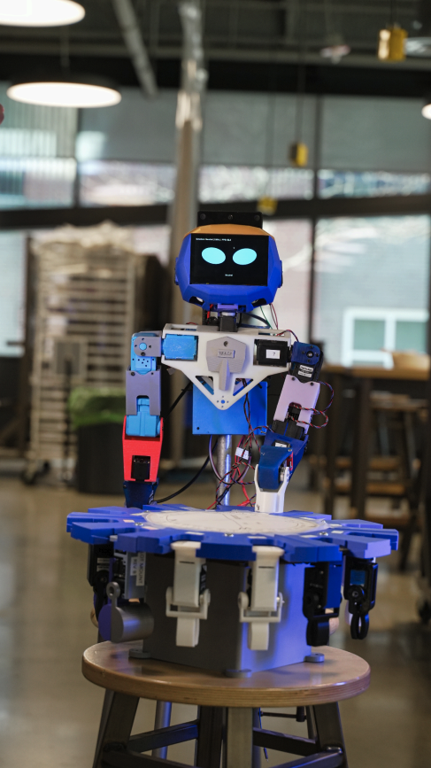

# Koalby MQP

## Hi there 👋

We are a Worcester Polytechnic Institute Major Qualifying Project team working on Finley, and Ava, open-source toddler-sized humanoid robots designed for assistive applications. Our project spans multiple years with successive MQP teams building upon previous work to advance humanoid robot development.
